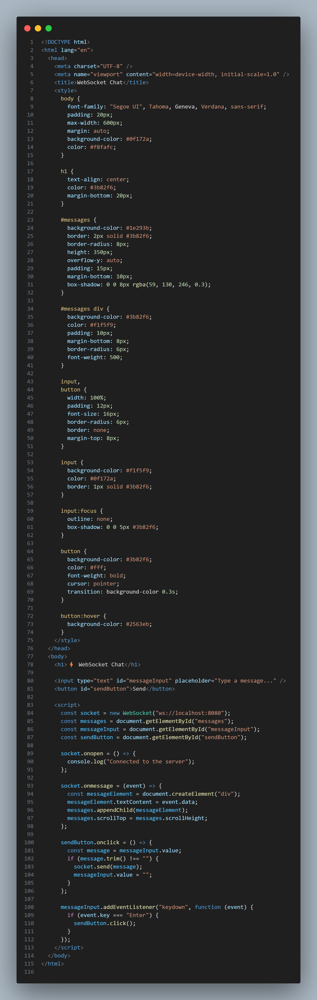
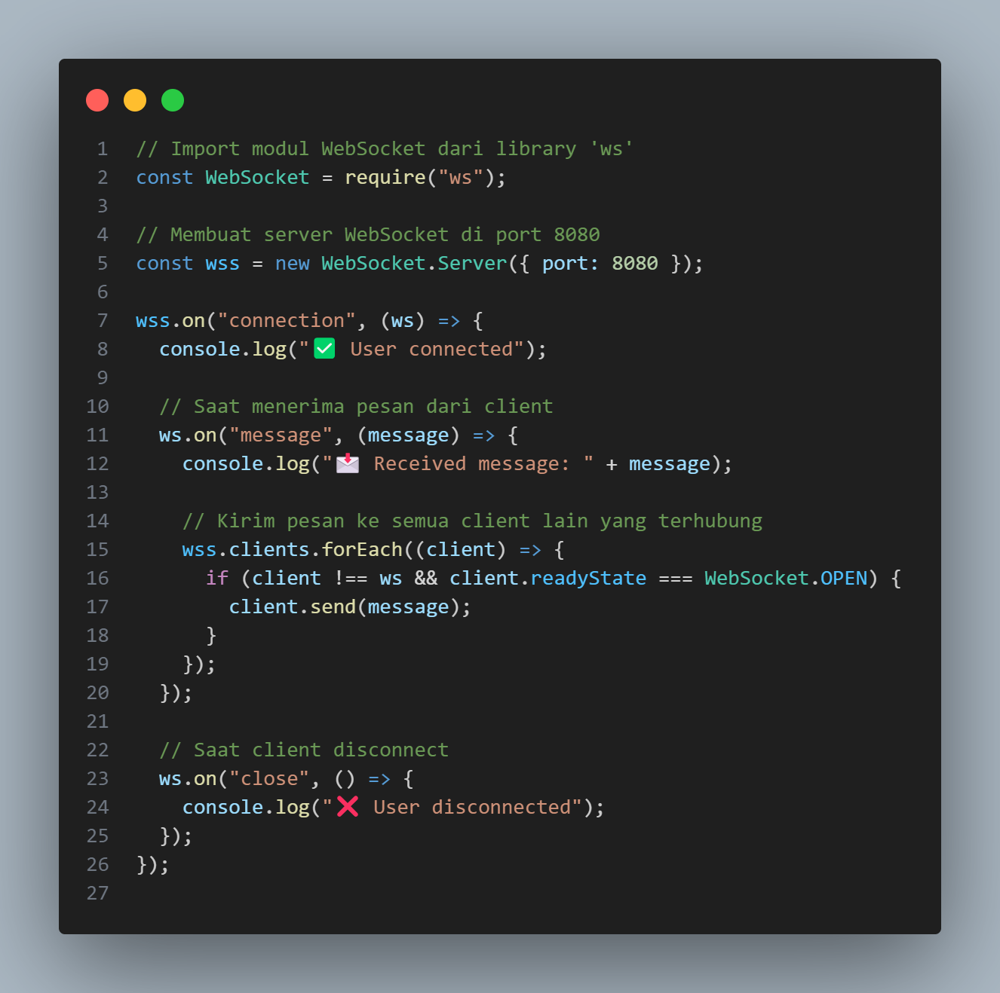
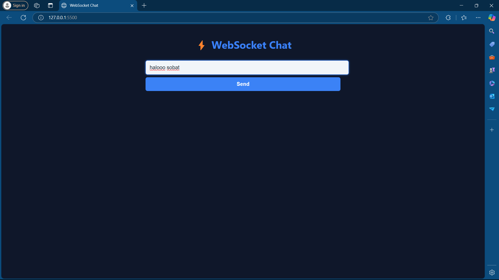
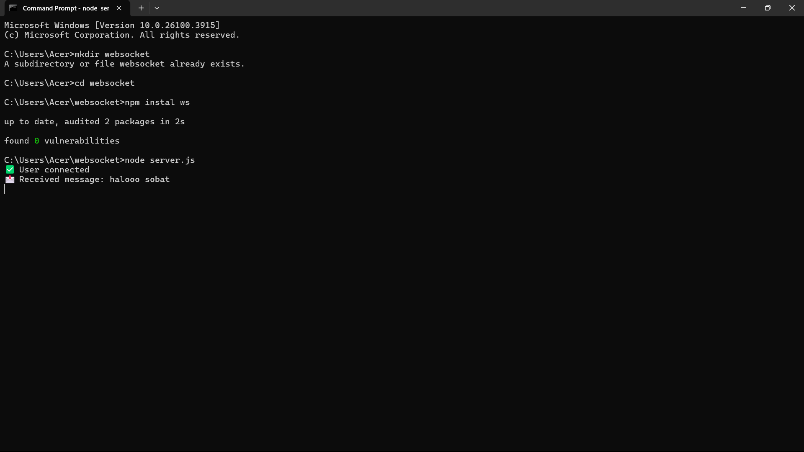

# WEBSOCKET

| UTS |  Pemrograman Web 2  
|-------|---------
| NIM   | 312310576
| Nama  | Nabil Lio Sawares
| Kelas | TI.23.A6
| Dosen |  Agung Nugroho, S.Kom., M.Kom.
| Link Artikel | https://medium.com/@nabilsawares/websocket-solusi-komunikasi-dua-arah-dalam-dunia-web-1f223b00bd93 |

## WebSocket: Solusi Komunikasi Dua Arah dalam Dunia Web
WebSocket adalah teknologi yang memungkinkan komunikasi dua arah secara langsung antara browser dan server. Jadi, setelah koneksi dibuka, keduanya bisa saling kirim data kapan saja tanpa harus menunggu permintaan dulu. Ini sangat berguna untuk aplikasi yang butuh update cepat, seperti chat, game online, atau notifikasi langsung. Dibanding HTTP biasa, WebSocket lebih cepat dan efisien karena tidak perlu buka-tutup koneksi terus-menerus.

## cara pengimpementasianya
masuk ke command prompt (CMD)
Kemudian ketik kode berikut :
### mkdir websocket 
>untuk membuat folder websocket

### buat file index.html didalam folder websocket

### buat file server.js didalam folder websocket

### cd websocket 
>untuk masuk pada folder websocket yang barusaja dibuat
### npm instal ws 
>untuk Menginstal library ws (WebSocket) di proyek Node.js

berikut adalah hasil ketika project di runn

kemudian foto dibawah adalh output dari pesan yang dikirim pada gambar diatas

